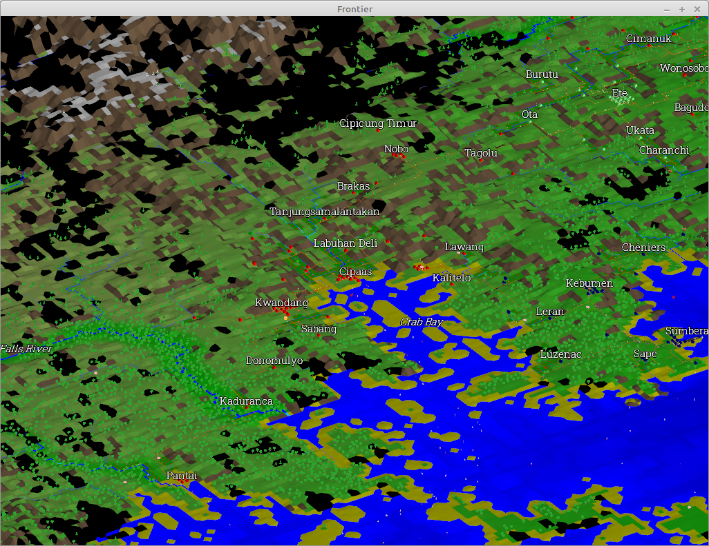

# What is this?

This was intended to be monorepo containing runnable applications together with various library crates shared between applications.

In practice there is a single application, which is [frontier](./frontier) - an unusual "game" which attempts to simulate the exploration and development of an undiscovered continent - think Civilization meets Transport Tycoon.

Supporting library crates are:
* [commons](./commons) Various utility type functionality used across other libraries and applications
* [isometric](./isometric) OpenGL based isometric game engine
* [network](./network) Simple pathfinding library
* [pioneer](./pioneer) Terrain generation (key feature is that it produces terrain where there is a downhill path to the edge of the terrain from any point - required to place natural looking rivers)

As a personal project, this is all poorly documented. I am adding this documentation because I am conscious that I have my Github account on my CV.

I've learnt Rust and changed approaches as I've gone along. [network](./network) was developed first (stolen from my [hanger-lane](https://github.com/TGElder/hanger-lane) project), [pioneer](./pioneer) was next (ported from my Java [downhill](https://github.com/TGElder/downhill) project), then [isometric](./isometric) and then [frontier](./frontier). Most work is in [frontier](./frontier). If you want to see how I currently write Rust, look at [recent commits](https://github.com/TGElder/rust/commits/develop). Of course, since this is a personal project, I will always have to cut corners in the interest of time.