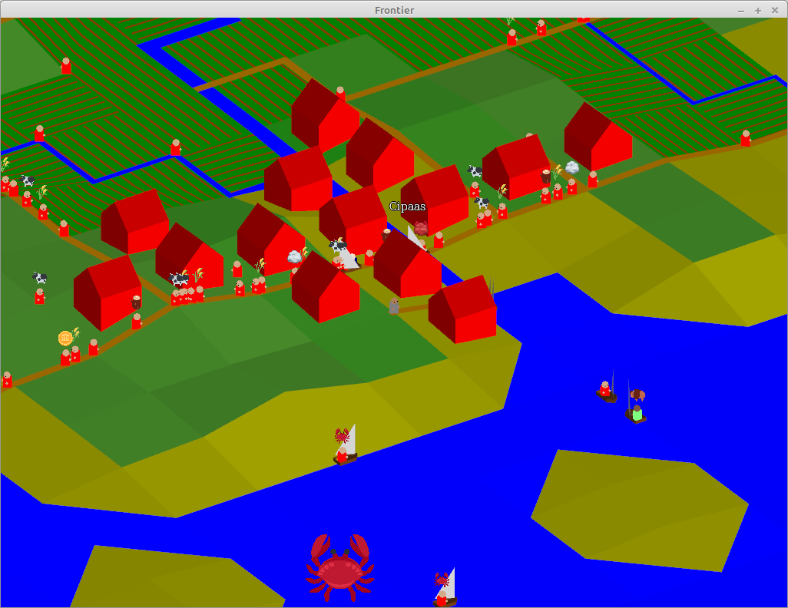
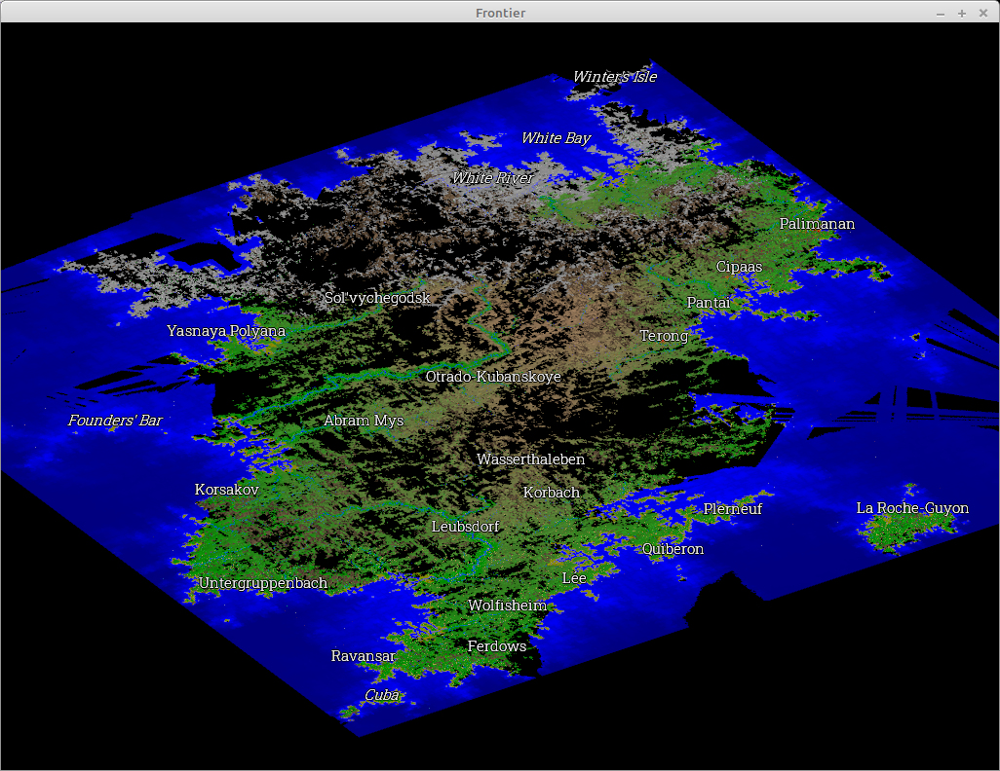

# Gameplay

The game simulates the exploration and development of an undiscovered continent. 

After launching the program, a map will be generated - this takes some time. You can see a countdown in the terminal. Some maps are rejected, in which case the process repeats.

You start in a boat which has sailed to the continent from some random position to the east or west.

At the moment you just explore the map. The off map nations will automatically start developing the area you reveal. Some resources are found on the map. Settlements are built beside these resources and at the location of ports or bridges. Off-map nations automatically explore the sea between their position at the edge of the map and any discovered coast.

# Controls

* **WASD** to move the avatar
* **Right Click** to move the avatar to the position under the cursor (the avatar will use the best route, or stop if no route is possible)

Note that it is currently only possible to transfer between land and water by right-clicking (WASD will not work). It is only possible the transfer from land to sea where the sea is deep enough.

* **Q**/**E** to rotate the map

Rotation and zooming are centred on the avatar when the camera is locked on the avatar. Otherwise the cursor position is used as the centre (similar to Google Maps). Note that, in this mode, you cannot rotate with the cursor over an unexplored tile.

* **Mouse Wheel** or **+**/**-** to zoom in and out
* **C** to toggle whether the camera is locked to the avatar
* **Left Mouse Drag** to move the map (when the camera is not locked to the avatar)
* **Space** to pause the game.
* **P** to save the game. Only one saved game is supported.
* **Ctrl + X** will make the avatar follow rivers (useful for exploring)
* **Ctrl + O** toggles an overlay showing who controls each tile
* **L** to add a label to the terrain under the cursor (press **Return** to finish labelling, all keyboard input will be captured until you do this)
* **Alt + L** cycles town labels on and off

Exit by closing the window.

Pausing, saving and exiting are not immediate as the game must bring all its threads to a restorable state. Check the terminal if you're not sure what is happening.

# Running

Proper handling for this is on my To Do list, for now you can run

`cargo run --release <map_size> <seed> <simulation_threads> [-r]`

* the map with be a square of `2 ^ map_size` width. Larger maps use more memory and CPU. I use `10` for playing and `9` for quick testing.
* `seed` is a number - each number results in a different map.
* `simulation_threads` controls how many threads are used for the simulation - a reasonable value is half the number of CPU cores
* `-r` will start with the map fully revealed

## Loading a saved game

Run `cargo run --release save <simulation_threads>`

## Window size

Initial window size is currently hard coded into [./src/main.rs](), you will want to change this if your screen cannot fit a 1024x768 window. The window can be resized once the game is running.

## Compatability

I cannot be sure this will work on anything other than my own desktop and laptop (both Linux Mint, though I have run it on Windows in the past). Town labels greatly reduce performance on my laptop, you can cycle these off with **Alt + L**.

Memory usage grows as the map is developed, but 4GB is probably sufficient for a size 10 map.

# Attributions

Graphics in [./resources/textures/fxemoji](./resources/textures/fxemoji) from [Mozilla FxEmojis](https://github.com/mozilla/fxemoji) are licensed under [CC BY 4.0](https://creativecommons.org/licenses/by/4.0/).

Graphics in [./resources/textures/twemoji](./resources/textures/twemoji) from [Twitter Open Source Twemoji](https://twemoji.twitter.com/) are licensed under [CC BY 4.0](https://creativecommons.org/licenses/by/4.0/). Graphics in [./resources/textures/twemoji/derivative](./resources/textures/twemoji/derivative) are derivative.

Sprite sheets in [./resources/textures/sprite_sheets](./resources/textures/sprite_sheets) are a combination of the above graphics.

# Screenshots

Same town (Cipaas) visible at three different zoom levels.

